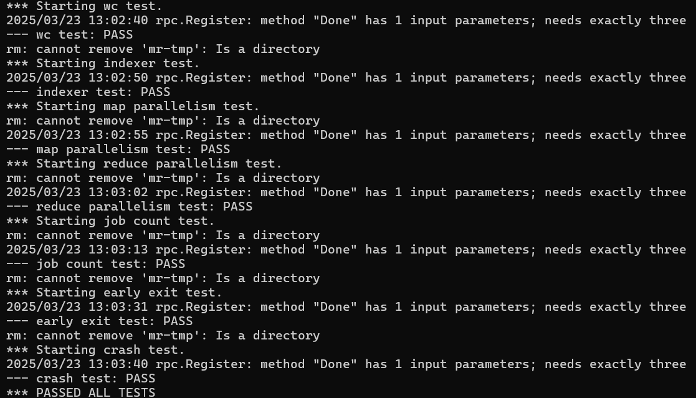
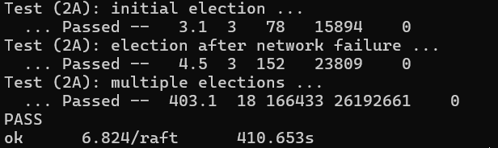

# MIT-6.824 Labs

# MapReduce

## 核心

本项目的核心主要在于 **Coordinator** 对任务的分配与对崩溃（crash）Worker 的处理策略。

------

## Coordinator 端设计

### 1. 任务初始化

- 将所有任务初始化为“空闲”状态，等待分配。

### 2. 接收并处理 Worker 请求

- **Worker 注册请求**：
  - 分配 Worker ID 并进行注册。
  - 开启监控线程，如果 Worker 超过 10s 没有请求发送，则自动注销该 Worker。
- **Worker 获取任务请求**：
  - 刷新 Worker 的心跳时间戳。
  - 如果存在空闲任务，将任务分配给该 Worker；否则返回空任务，提示 Worker 稍后再尝试。
- **Worker 完成任务请求**：
  - Worker 提交已完成的任务结果。
  - 如果发现提交者已不在注册表中，视为崩溃 Worker，拒绝任务提交。
  - 如果 Worker 正常，刷新其心跳并记录任务完成状态。
- **Worker 心跳请求**：
  - 更新 Worker 最近活动时间，维持活跃状态。

### 3. Coordinator 关闭条件

- 当所有 Map 与 Reduce 任务均已完成后，自动关闭。

------

## Worker 端流程

### 1. 注册

- 向 Coordinator 发送注册请求，获得唯一 Worker ID。

### 2. 请求任务

- 向 Coordinator 询问任务。
- 若返回空任务，等待一段时间后重试。

### 3. 执行任务

- 获取任务后，启动独立 goroutine 定时向 Coordinator 发送心跳，防止因任务执行时间过长被误判为崩溃。
- 任务完成后，停止心跳 goroutine，向 Coordinator 提交任务结果。

### 4. 循环处理

- 持续循环请求任务并执行，直到所有任务处理完成或无法连接到 Coordinator（Coordinator 关闭）。

## 测试结果

## Raft

## Part 2A: Leader Election

### 测试结果

18个server，迭代800次，每次迭代随机4台机器掉线

## Part 2B: Log Replication

### 实现

1. **节点角色与数据接收**
   - 只有成为 **leader** 的节点可以接收新的数据。**follower** 和 **candidate** 节点会拒绝接收新的数据。
2. **Leader 选举**
   1. **2B 的 Leader 选举与 2A 不同**：在 2A 中，选举时不需要考虑自己的日志和候选者日志的新旧程度，而在 2B 中，需要考虑：
      - 如果本节点记录的最后一条日志的 **term** 超过了候选者的 **LastLogTerm**，说明候选者的日志比较旧，本节点可以拒绝投票。
      - 如果本节点的最后一条日志与候选者相同，且 **PrevLogIndex** 比候选者的 **LastLogIndex** 要长，本节点可以拒绝投票。
      - 总结：只有当 **PrevLogTerm <= LastLogTerm && PrevLogIndex <= LastLogIndex** 时，才能投票，否则拒绝投票。
   2. 为了避免频繁的选举触发，建议设置更大的 **ElectionTimeout** 范围。若不调整范围，可能会导致 **follower** 或 **candidate** 频繁超时，进而重新触发选举，导致新的 **leader** 选举出来后又被推翻，造成选举风暴。
   3. 一旦 **leader** 选举成功，它会初始化 **nextIndex[]**，并将所有值设置为 **len(this.logs)**。
3. **Leader 新日志添加**
   1. 当新日志被添加时，**leader** 会将日志追加到 **logs** 数组中，并通过 **channel** 发送该日志的索引到负责复制日志的协程，通知其进行日志同步。
   2. 日志同步过程：
      - 复制日志时，使用 **nextIndex[followerId]** 来确定从哪里开始同步，发送 **logs[nextIndex[followerId]: ]**。
      - 如果多条日志并发写入，日志索引会保持不变，后续的日志可以一起同步，减少了 RPC 次数。
      - 当日志与 **follower** 冲突时，回退 **nextIndex[followerId]**，实现优化的回退算法。
      - 当超过半数的 **follower** 复制成功后，更新 **commitIndex** 为 **复制的最后一个日志的 Index**。
4. **Follower 的 AppendEntries**
   1. 如果 **follower** 的 **LastLogIndex** 小于 **PrevLogIndex**，说明 **leader** 发送的日志起始位置大于 **follower**，无法接收日志，返回 **false**。
   2. 如果 **follower** 的 **LastLogIndex** 大于等于 **PrevLogIndex**，比较 **logs[PrevLogIndex].Term** 和 **PrevLogTerm**，若不相同，则说明存在冲突，无法同步，返回 **false**。
   3. 当日志不冲突时，更新 **follower** 的 **logs = logs[:PrevLogIndex+1]**，删除冲突日志，并将 **leader** 发来的日志添加到 **logs** 末尾。
   4. 收到心跳时，**leaderCommitIndex** 会携带 **leader** 提交的最大日志 **index**。如果 **follower** 的 **commitIndex** 小于 **leaderCommitIndex**，则更新 **commitIndex = min(len(logs)-1, leaderCommitIndex)**。

### 测试结果

成功通过 200 轮测试，稳定运行。

